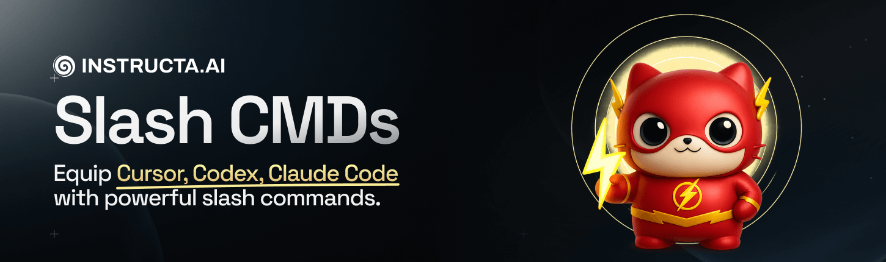

# Slash Commands Collection

<div align="center">
  
</div>

A curated collection of AI-powered slash commands for code review, problem analysis, and refactoring workflows.

## Installation

### Cursor
Place these files in `.cursor/commands/` directory. Remove the `$1` parameters and XML wrapping tags when using in Cursor.

**Official docs**: [Cursor Slash Commands](https://cursor.com/docs/cli/reference/slash-commands)

### Codex
Place these files in `~/.codex/prompts/` directory. Restart Codex after installation for changes to take effect.

**Official docs**: [Codex Prompts](https://github.com/openai/codex/blob/main/docs/prompts.md)

### Claude Code
Claude Code supports both project-specific and personal commands:

**Project commands** (shared with team):
```bash
mkdir -p .claude/commands
# Copy command files to .claude/commands/
```

**Personal commands** (available across all projects):
```bash
mkdir -p ~/.claude/commands
# Copy command files to ~/.claude/commands/
```

**Official docs**: [Claude Code Slash Commands](https://docs.claude.com/en/docs/claude-code/slash-commands)

## Commands

### 1. `plan-review`
Reviews implementation plans and provides a go/no-go decision for development. Evaluates:
- Codebase alignment and current patterns
- Scope clarity and completeness
- Performance, security, and privacy impact
- Code smells and potential caveats

**Usage**: `/plan-review <your-plan>`

### 2. `code-review-low` & `code-review-high`
Comprehensive code review commands for post-implementation analysis.

**`code-review-low`**: Fast review focusing on critical issues
- Code smells and security vulnerabilities
- Performance bottlenecks
- Essential test coverage

**`code-review-high`**: Thorough review with extended analysis
- All `code-review-low` checks plus additional validations
- Deeper security and performance analysis
- Comprehensive test recommendations

**Usage**: `/code-review-low "review unstaged files"` or `/code-review-high <task-description>`

### 3. `problem-analyzer`
Identifies bugs and maps affected files across the codebase. Provides:
- Root cause analysis
- File impact assessment
- Minimal safe fix proposals
- Documentation gap identification

**Usage**: `/problem-analyzer <problem-description>`

### 4. `refactor-code`
Initiates refactoring workflows with clear scope and isolation:
- Feature-specific refactoring
- Commit isolation guidelines
- Documentation of unrelated issues (without fixing)
- No backward compatibility or feature flags

**Usage**: `/refactor-code <refactoring-goal>`

## Workflow Tips

- Use `code-review-low` after implementing features for quick validation
- Use `code-review-high` for major changes or before releases
- Combine `problem-analyzer` with debugging sessions for faster issue resolution
- Use `plan-review` before starting complex implementations

## Links

- **X/Twitter**: [@kregenrek](https://x.com/kregenrek)
- **Bluesky**: [@kevinkern.dev](https://bsky.app/profile/kevinkern.dev)
- **Website**: Learn to build software with AI: [instructa.ai](https://www.instructa.ai)

## My other projects
* OpenAI Codex Tools [codex-1up](https://github.com/regenrek/codex-1up)
* [AI Prompts](https://github.com/instructa/ai-prompts/blob/main/README.md) - Curated AI Prompts for Cursor AI, Cline, Windsurf and Github Copilot
* [codefetch](https://github.com/regenrek/codefetch) - Turn code into Markdown for LLMs with one simple terminal command
* [aidex](https://github.com/regenrek/aidex) A CLI tool that provides detailed information about AI language models, helping developers choose the right model for their needs.# tool-starter